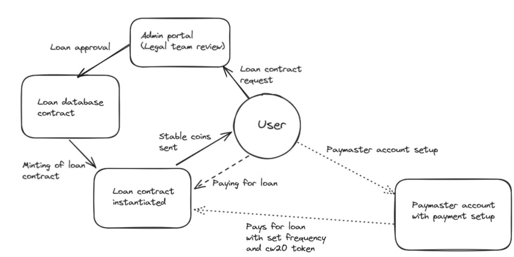

# Token Land

#### Overview
* Cosmos based CDP (collateral debt  protocol) with paymaster implementation for automated loan payments and gas optimization.
* Automated loan smart contracts which can accept payment from any token.
* Stake RWAs as collateral for loans.
* We've used ts code-gen to streamline building the frontend process.

*It is recommended to wait at least 3 seconds after clicking any button as it takes time for smart contracts to do the needed actions*

#### System Design (how it works)

#### Steps to run it locally

* First make sure WSL is installed on your pc and a cosmos compatible wallet like Keplr wallet.
* Create a new folder and open it in text editor of your choice
* Switch to wsl environment and type `git clone --branch <branch name> https://github.com/projectman14/mantra-rwa.git` in terminal.
* Type `cd mantra-rwa/`
* Type `npm i` to install dependencies.
* Run `npm run dev` command

#### How to use the website?

* First connect to Keplr walllet using `connect` button.
* Add our Cipher(CPR) token which is a cw20 token by selecting add token option in Keplr wallet.
* Select MANTRA Hongbai Testnet from dropdown options and add token using this contract address `mantra1lm9fah5umqde5vyppeleklk48j6s7t73psrerkr9n39gr5uman6q5v2qfj`
* Once CPR token has been added click on `Borrow Token` button and fill up your loan details form.
* Click on `Borrow Token` once all details have been filled.
* Go to admin dashboard https://tokenland.vercel.app/admin
* Admin dashboard displays list of all pending loan approvals.
* Accept or Reject the loan.
* Go to our homepage and click on `List Loan Status` to view loans corresponding to your wallet address.
* Enter the amount you want pay and click on `Pay Now`. Wait a few sec for the staus to update.
* You can check the amount of CPR tokens on your Keplr wallet.

##### Using our Paymaster

* Go to homepage and click on `PayMaster`
* When using for the first time, you will have to make a paymaster account by clicking on `First Setup Paymaster`. Wait for some time till the buttons change.
* Click on `Get Me One` to setup paymaster for your loans.
* Now send the CW20 token you want to pay with to your paymaster, whose contract address is given on page. *For current demonstration purposes, paymaster only supports CW20 token with decimals set to 6 right now and assumes each token to be worth 1 dollar* 
* Fill in token address and symbol of the CW20 token.
* Enter the amount (in dollars) to auto pay and its frequency.
* Click on `Setup Now` and wait a few sec for it to set up.
* Click on `TokenLand Paymaster` at top of screen to go back.
* Click on `PayMaster Status` to view the list of your pay masters.
* You can remove it by clicking on `Remove` button.

You can check the payment done by paymaster in the `List Loan Status` Page. Paymaster payment will fail if it has not been given enough tokens.

### Contract Addresses for reference

* Database Address: `mantra19u9j7yhj4ueqmnnw8xzw6ppxs4egugzuvljqqtx5ksrzfcaqp3uqxnrqpz`
* Cipher(CPR) coin Address: `mantra1lm9fah5umqde5vyppeleklk48j6s7t73psrerkr9n39gr5uman6q5v2qfj`
* Paymaster factory Address: `mantra12he2zga68ruefvzpftkxqudnjgq9erfsh9pvaud0ja24xgf3pxsqkc3jtv`
* PBK token Address: `mantra1fs0hmqgwemluzjr4q5s3l4eatp3u0jcj2kjafmqrk3375armfd2ss84d9t`
  
#### How our PayMaster works?

By decoupling gas fees from users, paymasters facilitate smoother onboarding, especially for newcomers, and enable more complex transaction scenarios, such as those involving meta-transactions. The user can currently fill in token address and symbol of a CW20 token of their choice whose decimals is set to 6, which will currently be priced at, for demonstration purposes, 1 token = 1 dollar. 
